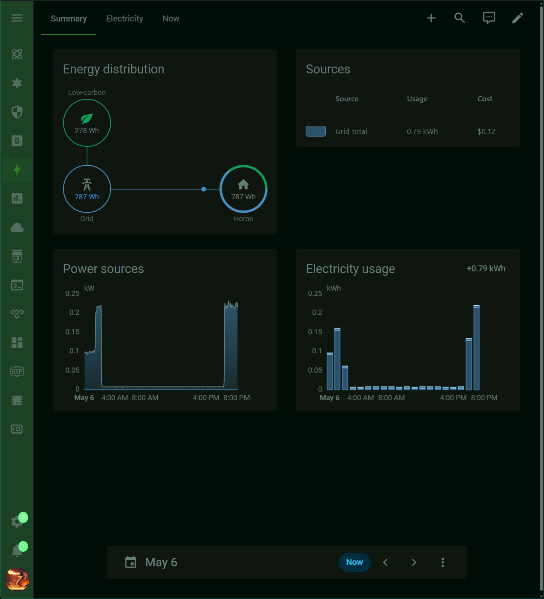

# Alien Blood Theme for Home Assistant

A bio-luminescent, terminal-inspired theme for Home Assistant — inspired by the classic **Alien Blood** color scheme. Deep, near-black backgrounds; muted moss-green text; and an electric phosphor-green accent that glows just enough to feel alive.

Two flavors are included from a single install: **Metro Alien Blood** (flat, sharp-cornered) and **Fluent Alien Blood** (soft, rounded, slightly tinted) — both sharing one carefully-tuned typographic system.

[](https://github.com/hacs/integration)
[](https://github.com/dhahaj/Alien-Blood-Theme-for-Hass/actions/workflows/validate.yml)

---

## Preview



---

## Highlights

- **Two design languages, one palette**
  - **Metro Alien Blood** — flat, zero-radius, sharp corners. Inspired by Windows 8 / Windows Phone tile design.
  - **Fluent Alien Blood** — softly rounded corners, subtly tinted backgrounds, blurred dialogs. Inspired by Windows 11.
- **The Alien Blood palette** — phosphor-green accent (`#73fa91`) on a deep `rgb(0,14,7)` background, with muted moss-green text (`rgb(99,125,117)`).
- **Light & dark modes** that follow your Home Assistant preference automatically.
- **Refined typography** using the Segoe UI Variable stack with carefully-set weights, sizes, and line heights for headings, card titles, body, and captions.
- **Card-mod aware** — ships with thoughtful tweaks to entity rows, glance cards, more-info dialogs, the sidebar, and the app header (including a translucent, blurred header on supported browsers).
- **Mushroom-friendly** — variables for chips, badges, sliders, and shapes are pre-tuned.

## Available themes

| Theme                 | Style                                |
| --------------------- | ------------------------------------ |
| Metro Alien Blood     | Flat, sharp corners                  |
| Fluent Alien Blood    | Rounded corners, blurred dialogs     |

## Installation

### Via HACS (recommended)

1. Open **HACS** in Home Assistant.
2. Go to **Frontend**, click the menu in the top-right, and choose **Custom repositories**.
3. Add this repository's URL with category **Theme**.
4. Search for **Alien Blood Theme** and install it.
5. Make sure the following is in your `configuration.yaml`:
   ```yaml
   frontend:
     themes: !include_dir_merge_named themes
   ```
6. Restart Home Assistant (or reload themes from **Developer Tools → YAML → Themes**).
7. Open your **Profile**, scroll to **Theme**, and pick **Metro Alien Blood** or **Fluent Alien Blood**.

### Manual

1. Copy `themes/alien-blood.yaml` into your Home Assistant `config/themes/` directory.
2. Make sure `frontend: themes: !include_dir_merge_named themes` is in your `configuration.yaml`.
3. Restart Home Assistant and select the theme from your profile.

## Recommended companions

These aren't required, but the theme is designed with them in mind:

- [**card-mod**](https://github.com/thomasloven/lovelace-card-mod) — unlocks the deeper styling tweaks (translucent header, refined more-info dialogs, sidebar polish).
- [**Mushroom**](https://github.com/piitaya/lovelace-mushroom) — pre-tuned chip, badge, and shape sizing.

## Credits

- Color palette inspired by the **Alien Blood** terminal / VS Code color scheme.
- Bundled fonts: Segoe UI family in `www/` for local fallback.
- Thanks to the Home Assistant, HACS, card-mod, and Mushroom communities.

## License

See the repository for license details.
